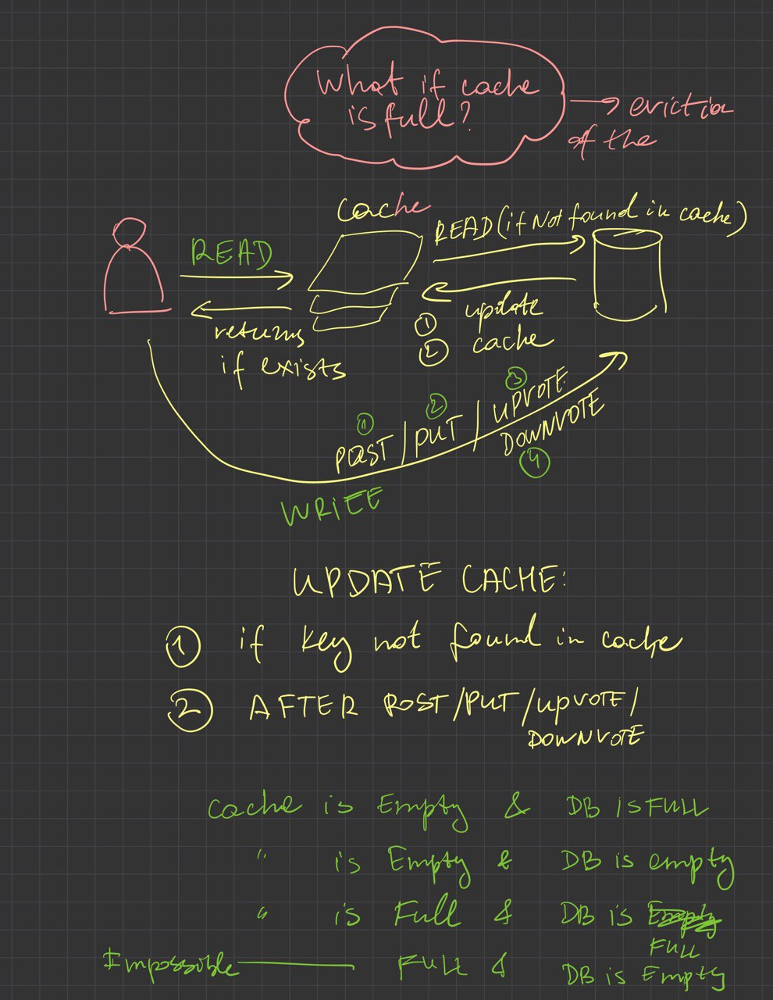

# Mini Hacker News Site RESTful API Documentation

This documentation covers the RESTful API for a Mini Hacker News site. To run this project, you need to install the Java JDK and set up Spring Boot.

## Prerequisites

Before running this project, you need to install the Java Development Kit (JDK). Follow these steps:

1. Download the latest Java JDK from the [Oracle website](https://www.oracle.com/java/technologies/javase-jdk11-downloads.html).
2. Install the JDK on your machine. If you need help, follow the installation instructions specific to your operating system.
3. Verify the installation by opening a terminal and running `java -version`. This should display the version of the Java JDK.

Additionally, ensure that you have Maven installed to manage project dependencies. Install Maven by following the instructions on the [Apache Maven Project website](https://maven.apache.org/install.html).

## Mini Hacker News

Welcome to the Mini Hacker News project! This is a lightweight version of the popular news aggregation site tailored for simple use and ease of deployment. Built with Spring Boot, this project features a RESTful API that allows users to create, update, view, and vote on posts.

## Features

- Create new posts
- Fetch top posts
- Update existing posts
- Upvote and downvote posts

## Installation

1. **Clone the repository**

   
```bash
   git clone https://github.com/WildandArt/HackerNewsAPI.git
   cd mini-hacker-news
```


2. **Install dependencies**

   Using Maven, you can install all required dependencies for the project:

   
```bash
   mvn install
```

3. **Run the application**

   Once the dependencies are installed, you can run the application using:

   
```bash
   mvn spring-boot:run
```

   This will start the application on http://localhost:8080.

## API Usage

Here are some examples of how you can interact with the API using curl:

### Create a Post

```bash
curl -X POST http://localhost:8081/posts \
     -H "Content-Type: application/json" \
     -d '{
           "userId": 1,
           "author": "John Doe",
           "url": "http://example.com/post",
           "title": "My First Post"
         }'
```

### Get Top Posts

```bash
curl http://localhost:8080/posts
```

### Update a Post

```bash
curl -X PUT http://localhost:8080/posts/<ID> \
-H "Content-Type: application/json" \
-d '{"content": "Updated post content"}'
```

### Upvote a Post

```bash
curl -X POST http://localhost:8080/posts/<ID>/upvote
```

### Downvote a Post

```bash
curl -X POST http://localhost:8080/posts/<ID>/downvote
```

## Database Schema

Below is the schema used by the Mini Hacker News database:


## Invalidation Strategy
#### Case 1: Update of a post automatically updates the time of the creation of the post, which changes the score. fields: created_at and score should be updated in DB and Cache if post_id exists in already Cache.
#### Case 2: Upvote/Downvote changes the score. Update should be made to DB and in Cache if exists in Cache.
#### Case 3: Creation of a Post may change the sorted list by GET.The Cache could not be changed.


# Testing:
# How to Use a Postman Collection JSON File

## 1. Download the Collection JSON File
- First, ensure you have the Postman collection JSON file saved to your local machine.
You can access the Postman collection file [here](Postman/HackerNewsAPI.postman_collection.json).
. This file contains all the endpoints, requests, and configurations defined in the collection.

## 2. Importing the Collection into Postman
1. **Open Postman.**
2. On the main interface, look for the **“Import”** button. This is usually located on the top left side of the app.
3. Click on **“Import.”**
4. In the import dialog that appears, choose the **“Upload Files”** tab.
5. Click **“Choose Files”** or drag the JSON file directly into the import area.
6. Navigate to `/home/art/dev/java/HackerNewsAPI/Postman/HackerNewsAPI.postman_collection.json` and select it.
7. Once the file is selected, click **“Import”** to load the collection into Postman.

## 3. Using the Imported Collection
- After importing, the collection will appear in your **"Collections"** tab on the left sidebar.
- Expand the collection to view all the requests, folders, and other configurations within it.
- Click on any request to view its details, including the method, URL, headers, and body content.
- You can now execute any of the requests by selecting them and clicking the **“Send”** button.

## 4. Editing and Customizing the Collection
- You can modify any request within the collection to suit your needs. This includes changing endpoints, parameters, headers, and body content.
- If you need to add new requests, you can do so within the same collection by right-clicking the collection name and selecting **"Add Request."**

## 5. Running Tests and Pre-Scripts
- If the collection includes tests or pre-request scripts, these will run automatically when you send the requests.
- To view or edit these scripts, click on the **“Tests”** or **“Pre-request Script”** tab within the request.

## 6. Saving and Exporting Changes
- After making changes to the collection, you can save your work by clicking the save button.
- If you need to share your modified collection with others, you can export it by right-clicking the collection name, selecting **“Export,”** and choosing the format (usually JSON).

## Contributing

Contributions to the Mini Hacker News project are welcome! Please feel free to fork the repository, make your changes, and submit a pull request.

## License

This project is licensed under the MIT License


