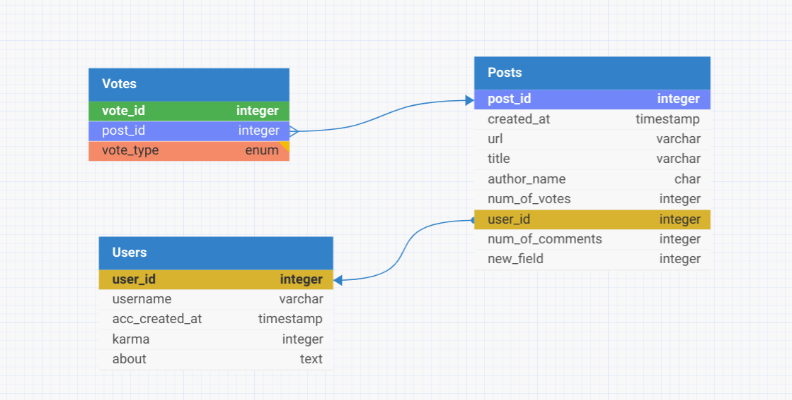

# Mini Hacker News Site RESTful API Documentation

This documentation covers the RESTful API for a Mini Hacker News site. To run this project, you need to install the Java JDK and set up Spring Boot.

## Prerequisites

Before running this project, you need to install the Java Development Kit (JDK). Follow these steps:

1. Download the latest Java JDK from the [Oracle website](https://www.oracle.com/java/technologies/javase-jdk11-downloads.html).
2. Install the JDK on your machine. If you need help, follow the installation instructions specific to your operating system.
3. Verify the installation by opening a terminal and running `java -version`. This should display the version of the Java JDK.

Additionally, ensure that you have Maven installed to manage project dependencies. Install Maven by following the instructions on the [Apache Maven Project website](https://maven.apache.org/install.html).

## Mini Hacker News

Welcome to the Mini Hacker News project! This is a lightweight version of the popular news aggregation site tailored for simple use and ease of deployment. Built with Spring Boot, this project features a RESTful API that allows users to create, update, view, and vote on posts.

## Features

- Create new posts
- Fetch top posts
- Update existing posts
- Upvote and downvote posts

## Installation

1. **Clone the repository**

   
```bash
   git clone https://github.com/WildandArt/HackerNewsAPI.git
   cd mini-hacker-news
```


2. **Install dependencies**

   Using Maven, you can install all required dependencies for the project:

   
```bash
   mvn install
```

3. **Run the application**

   Once the dependencies are installed, you can run the application using:

   
```bash
   mvn spring-boot:run
```

   This will start the application on http://localhost:8080.

## API Usage

Here are some examples of how you can interact with the API using curl:

### Create a Post

```bash
curl -X POST http://localhost:8080/posts \
-H "Content-Type: application/json" \
-d '{"content": "This is a new post"}'
```

### Get Top Posts

```bash
curl http://localhost:8080/posts
```

### Update a Post

```bash
curl -X PUT http://localhost:8080/posts/<ID> \
-H "Content-Type: application/json" \
-d '{"content": "Updated post content"}'
```

### Upvote a Post

```bash
curl -X POST http://localhost:8080/posts/<ID>/upvote
```

### Downvote a Post

```bash
curl -X POST http://localhost:8080/posts/<ID>/downvote
```

## Database Schema

Below is the schema used by the Mini Hacker News database:



## Contributing

Contributions to the Mini Hacker News project are welcome! Please feel free to fork the repository, make your changes, and submit a pull request.

## License

This project is licensed under the MIT License


