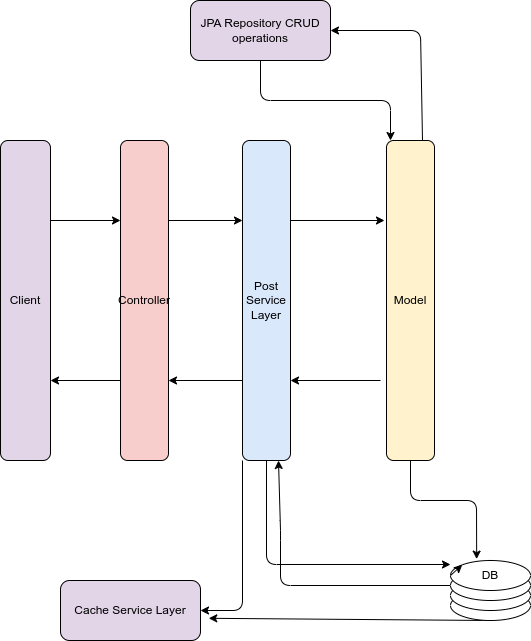

# Welcome to the Mini Hacker News project

The Mini Hacker News Project is an implementation of a content aggregation platform similar to Hacker News. This project provides a RESTful API for managing posts, allowing users to submit, view, and interact with various news articles. The core feature of the application is its caching system, which stores posts in a cache for efficient retrieval while ensuring that cached data remains fresh and relevant. By implementing a caching strategy, the project optimizes performance and reduces the load on the database, making it capable of handling high traffic scenarios typical of popular news aggregation sites.

## Table of Contents

1. [Requirements](#requirements)
2. [Main Entities](#main-entities)
3. [Features](#features)
4. [UML Diagram](#uml-diagram)
5. [Prerequisites](#prerequisites)
6. [Installation](#installation)
   - [Application Properties Configuration](#application-properties-configuration)
   - [Database Setup](#database-setup)
   - [Docker Usage](#docker-usage)
7. [API Usage](#api-usage)
   - [Endpoints](#endpoints)
   - [Postman Collection](#postman-collection)
   - [Error Handling](#error-handling)
8. [Cache Strategy](#cache-strategy)
9. [Support and Contributions](#support-and-contributions)
10. [License](#license)


## Requirements

Before running this project, you need to install the Java Development Kit (JDK). Follow these steps:

1. Download the latest Java JDK from the [Oracle website](https://www.oracle.com/java/technologies/javase-jdk11-downloads.html).
2. Install the JDK on your machine. If you need help, follow the installation instructions specific to your operating system.
3. Verify the installation by opening a terminal and running `java -version`. This should display the version of the Java JDK.

Additionally, ensure that you have Maven installed to manage project dependencies. Install Maven by following the instructions on the [Apache Maven Project website](https://maven.apache.org/install.html).

## Main Entities

### 1. **NewsPostModelImpl**
- **Description**: Represents the main entity for a news post in the application.
- **Key Fields**:
  - `postId`: Unique identifier for the post.
  - `url`: The URL of the news post.
  - `title`: The title of the post.
  - `currentVotes`: Number of votes the post has received.
  - `createdAt`: Timestamp when the post was created.
  - `score`: Score of the post, typically derived from its popularity.
  - `timeElapsed`: Time elapsed since the post was created.
  - `postedBy`: The author of the post.

### 2. **CacheEntityImpl**
- **Description**: Represents a custom implementation of a caching mechanism to store and retrieve `NewsPostModelImpl` objects.
- **Key Features**:
  - Caches posts to improve retrieval speed and reduce database queries.
  - Implements size-limiting and stale data invalidation logic.

### 3. **CacheEntityServiceImpl**
- **Description**: Service that interacts with `CacheEntityImpl` to provide caching functionalities.
- **Key Operations**:
  - `getPostFromCacheById(Long postId)`: Retrieves a single post from the cache by its ID.
  - `getAllPostsFromCache()`: Retrieves all cached posts, with a check for stale data.
  - `putPostInCache(NewsPostModelImpl post)`: Adds a single post to the cache.
  - `putAllPostsInCache(List<NewsPostModelImpl> posts)`: Adds a list of posts to the cache.
  - `evictPost(Long postId)`: Removes a specific post from the cache.
  - `clearCache()`: Clears all entries in the cache.

### 4. **PostRepository**
- **Description**: Repository interface for managing `NewsPostModelImpl` entities in the database.
- **Key Features**:
  - Provides basic CRUD operations for `NewsPostModelImpl`.
  - Extends Spring Data JPA, making it easy to interact with the database.

### 5. **NewsPostsResponseDTO**
- **Description**: Data Transfer Object interface used for transferring data related to news posts between the API and the client.
- **Key Fields**:
  - `postId`, `url`, `title`, `currentVotes`, `createdAt`, `score`, `postedBy`, etc.
  - These fields correspond closely to those in `NewsPostModelImpl`.

### 6. **HackerNewsAPIApplication**
- **Description**: The main entry point for the Spring Boot application.
- **Key Features**:
  - Initializes and configures the application.
  - Scans and sets up Spring Data JPA repositories and other Spring components.

## Supporting Components

### Database (PostgreSQL)
- **Description**: Manages the persistence of `NewsPostModelImpl` entities.
- **Configuration**: Integrated with Docker Compose for seamless setup and management in development and production environments.

### Docker & Docker Compose
- **Dockerfile**: Defines a multi-stage build for creating a lightweight Docker image of the application.
- **docker-compose.yml**: Configures the services, including the database and the application itself, for easy deployment.

## Project Structure
- **`src/main/java/com/username/HackerNewsAPI/`**: Contains the main source code, including models, services, and repositories.
- **`src/test/java/com/username/HackerNewsAPI/`**: Contains the test classes for unit and integration testing.

## Features

## Diagram
   <p align="center"> 
   
   </p>


## Prerequisites

Before you can run this project, ensure that you have the following software installed:

1. **Java Development Kit (JDK)**: 
   - Version: `17` or higher.
   - You can download it from [AdoptOpenJDK](https://adoptopenjdk.net/) or use a package manager like `sdkman` to install it.

2. **Maven**:
   - Version: `3.6.0` or higher.
   - Maven is used to build and manage the dependencies of the project. Download it from the [official website](https://maven.apache.org/download.cgi) or install it via a package manager like `brew` on macOS, `apt` on Ubuntu, or `choco` on Windows.

3. **Docker**:
   - Docker is required to containerize the application and its dependencies. 
   - Make sure Docker is installed and running on your machine. You can download Docker Desktop from [here](https://www.docker.com/products/docker-desktop).

4. **Docker Compose**:
   - Version: `1.27.0` or higher.
   - Docker Compose is used to manage multi-container Docker applications. It is usually included with Docker Desktop, but you can install it separately if needed.

5. **PostgreSQL**:
   - Version: `15.3` or compatible.
   - This project uses PostgreSQL as the database. You can run it via Docker or install it locally. Ensure you have the correct environment variables set for `POSTGRES_DB`, `POSTGRES_USER`, and `POSTGRES_PASSWORD`.

6. **Git**:
   - Version: `2.0` or higher.
   - Git is used for version control. Make sure you have Git installed to clone the repository.

### Environment Variables

Ensure the following environment variables are set up:

- `POSTGRES_DB`: Name of the PostgreSQL database.
- `POSTGRES_USER`: PostgreSQL username.
- `POSTGRES_PASSWORD`: PostgreSQL password.

### Optional Tools

- **IDE**: 
  - An Integrated Development Environment (IDE) like IntelliJ IDEA, Eclipse, or VS Code is recommended for working with the project.

- **cURL or Postman**:
  - These tools can be useful for testing API endpoints once the application is up and running.


# Installation

   1. **Clone the repository**

      
   ```bash
      git clone https://github.com/WildandArt/HackerNewsAPI.git
      cd mini-hacker-news
   ```


   2. **Install dependencies**

      Using Maven, you can install all required dependencies for the project:

      
   ```bash
      mvn install
   ```

   3. **Run the application**

      Once the dependencies are installed, you can run the application using:

      
   ```bash
      mvn spring-boot:run
   ```

   This will start the application on http://localhost:8080.
 
# Application Properties Configuration

The following properties are configured to manage the database connection, Hibernate settings, and data source details for the application. These configurations ensure that the application connects to the correct database, uses the appropriate credentials, and utilizes Hibernate for ORM (Object-Relational Mapping) with PostgreSQL.

### Database Connection Properties

- `spring.datasource.url`: Specifies the JDBC URL for connecting to the PostgreSQL database. This should be adjusted based on whether the application is running locally or within Docker. For local development, use `jdbc:postgresql://localhost:5432/mytestdatabase`. When using Docker, adjust it accordingly.
- `spring.datasource.username`: The username used for authenticating the connection to the PostgreSQL database.
- `spring.datasource.password`: The password associated with the username for database authentication.
- `spring.datasource.driver-class-name`: Specifies the driver class name for PostgreSQL, which is `org.postgresql.Driver`.

### Hibernate Settings

- `spring.jpa.database-platform`: Defines the SQL dialect for Hibernate, set to `org.hibernate.dialect.PostgreSQLDialect` to match PostgreSQL.
- `spring.jpa.hibernate.ddl-auto`: Configures the Hibernate DDL (Data Definition Language) auto-generation behavior. Set to `update` to automatically update the database schema as needed.
- `spring.jpa.show-sql`: If set to `true`, Hibernate will log the generated SQL statements to the console, which is useful for debugging and development.

### Example Properties File

```properties
# Database connection properties for local development
spring.datasource.url=jdbc:postgresql://localhost:5432/mytestdatabase
spring.datasource.username=mytestuser
spring.datasource.password=mytestpassword
spring.datasource.driver-class-name=org.postgresql.Driver

# Hibernate settings
spring.jpa.database-platform=org.hibernate.dialect.PostgreSQLDialect
spring.jpa.hibernate.ddl-auto=update
spring.jpa.show-sql=true
```

# Docker Usage Dockerfile

This Dockerfile builds and packages the Java application using Maven and then runs it with a lightweight JRE.

```dockerfile
# First stage: Build the application with Maven
FROM eclipse-temurin:17-jdk-ubi9-minimal as build
WORKDIR /app

# Install Maven
RUN microdnf install -y maven

# Copy the pom.xml file and download dependencies
COPY pom.xml .
RUN mvn dependency:go-offline

# Copy the source code and build the application
COPY src ./src
RUN mvn clean test

# Second stage: Use a lightweight JRE to run the application
FROM eclipse-temurin:17-jre-ubi9-minimal
WORKDIR /app
COPY --from=build /app/target/HackerNewsAPI-0.0.1-SNAPSHOT.jar app.jar
ENTRYPOINT ["java","-jar","app.jar"]
```
To build and start the application using Docker Compose, run the following commands:
```
docker-compose up --build
```
Alternatively, if the containers are already built, just start them
```
docker-compose up
```
If you need to run tests or interact with the application, you can use:
```
docker-compose run --rm app
```

# Database connection settings
Configure your application properties to connect to the PostgreSQL database inside the Docker container. This file is typically located at src/main/resources/application.properties.
Using Docker Version of properties file:
```
spring.datasource.url=jdbc:postgresql://db:5432/mydatabase
```

If you need to run the application locally without Docker, use the following settings.
```
spring.datasource.url=jdbc:postgresql://localhost:5432/mytestdatabase
```

## Allowed CRUD Operations

- Create new posts
- Get top posts
- Get all posts
- Update an existing post
- Upvote/Downvote a post
- Delete a post


<!-- ## API Usage

Here are some examples of how you can interact with the API using curl:

### Create a Post

```bash
curl -X POST http://localhost:8080/api/posts \
     -H "Content-Type: application/json" \
     -d '{
           "userId": 1,
           "author": "John Doe",
           "url": "http://example.com/post",
           "title": "My First Post"
         }'
```
### Get a Post by Id
```bash
curl http://localhost:8080/api/posts/id
```

### Get Top Posts

```bash
curl http://localhost:8080/api/top_posts
```

### Get All Posts

```bash
curl http://localhost:8080/api/posts
```

### Update a Post

```bash
curl -X PUT http://localhost:8080/api/posts/<ID> \
-H "Content-Type: application/json" \
-d '{"content": "Updated post content"}'
```

### Upvote a Post

```bash
curl -X PATCH http://localhost:8080/api/posts/<ID>/upvote
```

### Downvote a Post

```bash
curl -X PATCH http://localhost:8080/api/posts/<ID>/downvote
```

### Delete a Post

```bash
curl -X DELETE http://localhost:8080/api/posts/<ID>
``` -->

### Create a Post
Method: POST
URL: http://localhost:8080/api/posts

Headers:

Content-Type: application/json Request Body:
JSON
```
{
  "userId": 1,
  "author": "John Doe",
  "url": "http://example.com/post",
  "title": "My First Post"
}
```

Response: The response will be the newly created DTO Response post object in JSON format.

### Get a Post by Id

Method: GET

URL: ```http://localhost:8080/api/posts/{id} (replace {id} with the actual post ID)```

Response: The response will be the DTO post object with the specified ID in JSON format.


### Get Top Posts

Method: GET

URL: ```http://localhost:8080/api/top_posts```

Response: The response will be an array of the top posts in JSON format.


### Get All Posts
Method: GET
URL: 
```http://localhost:8080/api/posts```
Response: The response will be an array of all posts in JSON format.

### Update a Post

Method: PUT

URL: ```http://localhost:8080/api/posts/{id} ```

(replace {id} with the actual post ID)
Headers:

Content-Type: application/json 

Request Body:
JSON

```
{
  "url": "www.example.com",
  "title": "Updated title"
}
```

Response: The response will be the updated post object in JSON format.

### Upvote a Post

Method: PATCH

URL: ```http://localhost:8080/api/posts/{id}/upvote```

 (replace {id} with the actual post ID)
Response: The response will be the updated post object with the incremented upvote count in JSON format.

### Downvote a Post

Method: PATCH

URL: ```http://localhost:8080/api/posts/{id}/downvote``` 

(replace {id} with the actual post ID)
Response: The response will be the updated post object with the decremented downvote count in JSON format.

### Delete a Post

Method: DELETE

URL: ```http://localhost:8080/api/posts/{id} ```

(replace {id} with the actual post ID)

Response: A successful deletion typically returns a 204 No Content status code.

# How to Use a Postman Collection JSON File

## 1. Download the Collection JSON File
- First, ensure you have the Postman collection JSON file saved to your local machine.
You can access the Postman collection file [here](Postman/HackerNewsAPI.postman_collection.json).
This file contains all the endpoints, requests, and configurations defined in the collection.

## 2. Importing the Collection into Postman
1. **Open Postman.**
2. On the main interface, look for the **“Import”** button. This is usually located on the top left side of the app.
3. Click on **“Import.”**
4. In the import dialog that appears, choose the **“Upload Files”** tab.
5. Click **“Choose Files”** or drag the JSON file directly into the import area.
6. Navigate to `HackerNewsAPI/Postman/HackerNewsAPI.postman_collection.json` and select it.
7. Once the file is selected, click **“Import”** to load the collection into Postman.

## 3. Using the Imported Collection
- After importing, the collection will appear in your **"Collections"** tab on the left sidebar.
- Expand the collection to view all the requests, folders, and other configurations within it.
- Click on any request to view its details, including the method, URL, headers, and body content.
- You can now execute any of the requests by selecting them and clicking the **“Send”** button.

## 4. Editing and Customizing the Collection
- You can modify any request within the collection to suit your needs. This includes changing endpoints, parameters, headers, and body content.
- If you need to add new requests, you can do so within the same collection by right-clicking the collection name and selecting **"Add Request."**

## 5. Running Tests and Pre-Scripts
- If the collection includes tests or pre-request scripts, these will run automatically when you send the requests.
- To view or edit these scripts, click on the **“Tests”** or **“Pre-request Script”** tab within the request.

## 6. Saving and Exporting Changes
- After making changes to the collection, you can save your work by clicking the save button.
- If you need to share your modified collection with others, you can export it by right-clicking the collection name, selecting **“Export,”** and choosing the format (usually JSON).

## Contributing

Contributions to the Mini Hacker News project are welcome! Please feel free to fork the repository, make your changes, and submit a pull request.

## License

This project is licensed under the MIT License


