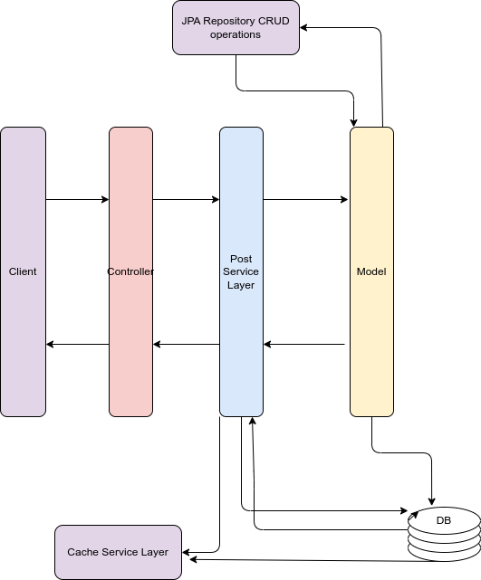

# Welcome to the Mini Hacker News project

The Mini Hacker News Project is an implementation of a content aggregation platform similar to Hacker News. This project provides a RESTful API for managing posts, allowing users to submit, view, and interact with various news articles. The core feature of the application is its caching system, which stores posts in a cache for efficient retrieval while ensuring that cached data remains fresh and relevant. By implementing a caching strategy, the project optimizes performance and reduces the load on the database, making it capable of handling high traffic scenarios typical of popular news aggregation sites.

## Table of Contents

1. [Requirements](#requirements)
2. [Main Entities](#main-entities)
3. [Features](#features)
4. [UML Diagram](#uml-diagram)
5. [Prerequisites](#prerequisites)
6. [Installation](#installation)
   - [Application Properties Configuration](#application-properties-configuration)
   - [Database connection settings](#database-connection-settings)
   - [User Configuration Settings](#user-configuration-settings)
   - [Docker Usage](#docker-usage)
7. [Allowed CRUD Operations](#allowed-crud-operations)
   - [Endpoints](#endpoints)
   - [Postman Collection](#postman-collection)
   - [Error Handling](#error-handling)
8. [Cache Strategy](#cache-strategy)
9. [Support and Contributions](#support-and-contributions)
10. [License](#license)


## Requirements

Before running this project, you need to install the Java Development Kit (JDK). Follow these steps:

1. Download the latest Java JDK from the [Oracle website](https://www.oracle.com/java/technologies/javase-jdk11-downloads.html).
2. Install the JDK on your machine. If you need help, follow the installation instructions specific to your operating system.
3. Verify the installation by opening a terminal and running `java -version`. This should display the version of the Java JDK.

Additionally, ensure that you have Maven installed to manage project dependencies. Install Maven by following the instructions on the [Apache Maven Project website](https://maven.apache.org/install.html).

## Main Entities

### 1. **NewsPostModelImpl**
- **Description**: Represents the main entity for a news post in the application.
- **Key Fields**:
  - `postId`: Unique identifier for the post.
  - `url`: The URL of the news post.
  - `title`: The title of the post.
  - `currentVotes`: Number of votes the post has received.
  - `createdAt`: Timestamp when the post was created.
  - `score`: Score of the post, typically derived from its popularity.
  - `timeElapsed`: Time elapsed since the post was created.
  - `postedBy`: The author of the post.

### 2. **CacheEntityImpl**
- **Description**: Represents a custom implementation of a caching mechanism to store and retrieve `NewsPostModelImpl` objects.
- **Key Features**:
  - Caches posts to improve retrieval speed and reduce database queries.
  - Implements size-limiting and stale data invalidation logic.

### 3. **CacheEntityServiceImpl**
- **Description**: Service that interacts with `CacheEntityImpl` to provide caching functionalities.
- **Key Operations**:
  - `getPostFromCacheById(Long postId)`: Retrieves a single post from the cache by its ID.
  - `getAllPostsFromCache()`: Retrieves all cached posts, with a check for stale data.
  - `putPostInCache(NewsPostModelImpl post)`: Adds a single post to the cache.
  - `putAllPostsInCache(List<NewsPostModelImpl> posts)`: Adds a list of posts to the cache.
  - `evictPost(Long postId)`: Removes a specific post from the cache.
  - `clearCache()`: Clears all entries in the cache.

### 4. **PostRepository**
- **Description**: Repository interface for managing `NewsPostModelImpl` entities in the database.
- **Key Features**:
  - Provides basic CRUD operations for `NewsPostModelImpl`.
  - Extends Spring Data JPA, making it easy to interact with the database.

### 5. **NewsPostsResponseDTO**
- **Description**: Data Transfer Object interface used for transferring data related to news posts between the API and the client.
- **Key Fields**:
  - `postId`, `url`, `title`, `currentVotes`, `createdAt`, `score`, `postedBy`, etc.
  - These fields correspond closely to those in `NewsPostModelImpl`.

### 6. **HackerNewsAPIApplication**
- **Description**: The main entry point for the Spring Boot application.
- **Key Features**:
  - Initializes and configures the application.
  - Scans and sets up Spring Data JPA repositories and other Spring components.

## Supporting Components

### Database (PostgreSQL)
- **Description**: Manages the persistence of `NewsPostModelImpl` entities.
- **Configuration**: Integrated with Docker Compose for seamless setup and management in development and production environments.

### Docker & Docker Compose
- **Dockerfile**: Defines a multi-stage build for creating a lightweight Docker image of the application.
- **docker-compose.yml**: Configures the services, including the database and the application itself, for easy deployment.

## Project Structure
- **`src/main/java/com/username/HackerNewsAPI/`**: Contains the main source code, including models, services, and repositories.
- **`src/test/java/com/username/HackerNewsAPI/`**: Contains the test classes for unit and integration testing.

## Features

1. **Real-time Content Aggregation**
   - Allows users to submit and view news posts in real-time. The application aggregates and ranks posts based on their scores, which are influenced by user votes and time elapsed.

2. **Custom Caching Mechanism**
   - Implements a high-performance caching system that stores the top posts in memory, reducing the load on the database and improving response times. The cache automatically evicts the least relevant posts when it reaches capacity and updates when posts are created, updated, or voted on.
   - **Thread Safety**: The caching mechanism is designed to be thread-safe, ensuring that multiple threads can access and modify the cache simultaneously without causing data inconsistencies. This is achieved through synchronized methods and concurrent data structures like `ConcurrentHashMap`.


3. **Dynamic Post Ranking**
   - Posts are ranked dynamically based on a custom scoring algorithm that takes into account both the number of votes and the time elapsed since posting. This ensures that the most relevant and popular posts are always at the top.

4. **Upvote and Downvote Functionality**
   - Users can upvote or downvote posts, which directly influences the post’s score and ranking. This feature is crucial for maintaining an accurate and community-driven ranking system.

5. **Pagination and Query Optimization**
   - Supports efficient pagination for large datasets, allowing users to navigate through posts with minimal performance impact. The application includes optimized queries to ensure quick retrieval of data.

6. **Flexible Configuration**
   - Provides configurable settings for cache size, pagination limits, update intervals, and logging levels. This allows administrators to tailor the application’s performance and behavior to their specific needs.

7. **Robust Error Handling**
   - Implements comprehensive error handling throughout the application, ensuring that users receive informative and user-friendly messages in case of issues, while also logging detailed errors for developers.

8. **Responsive API Endpoints**
   - Exposes a RESTful API that allows clients to interact with the application, including creating, retrieving, updating, voting on, and deleting posts. The API is designed to be efficient and easy to integrate with other systems.

9. **Post Scheduling and Maintenance**
   - Includes scheduled tasks that automatically update post scores and other fields at regular intervals, ensuring that the data remains fresh and relevant without manual intervention.

10. **Comprehensive Testing**
    - Includes unit tests, integration tests, and Postman collections to ensure the application is reliable, with all key functionalities thoroughly tested.


## UML Diagram
   <p align="center"> 
   
   </p>


## Prerequisites

Before you can run this project, ensure that you have the following software installed:

1. **Java Development Kit (JDK)**: 
   - Version: `17` or higher.
   - You can download it from [AdoptOpenJDK](https://adoptopenjdk.net/) or use a package manager like `sdkman` to install it.

2. **Maven**:
   - Version: `3.6.0` or higher.
   - Maven is used to build and manage the dependencies of the project. Download it from the [official website](https://maven.apache.org/download.cgi) or install it via a package manager like `brew` on macOS, `apt` on Ubuntu, or `choco` on Windows.

3. **Docker**:
   - Docker is required to containerize the application and its dependencies. 
   - Make sure Docker is installed and running on your machine. You can download Docker Desktop from [here](https://www.docker.com/products/docker-desktop).

4. **Docker Compose**:
   - Version: `1.27.0` or higher.
   - Docker Compose is used to manage multi-container Docker applications. It is usually included with Docker Desktop, but you can install it separately if needed.

5. **PostgreSQL**:
   - Version: `15.3` or compatible.
   - This project uses PostgreSQL as the database. You can either run PostgreSQL via Docker or install it locally on your machine.
   - **Docker Approach**: You can include PostgreSQL in your Docker setup. Ensure you have the correct environment variables set for `POSTGRES_DB`, `POSTGRES_USER`, and `POSTGRES_PASSWORD`.
   - **Local Installation**: If you prefer to install PostgreSQL locally, download it from the [official PostgreSQL website](https://www.postgresql.org/download/). After installation, ensure the PostgreSQL service is running, and you've created the necessary database and user. For help with installation and setup, refer to the [PostgreSQL Documentation](https://www.postgresql.org/docs/).
   - **Environment Variables**: Ensure you set up the following environment variables:
     - `POSTGRES_DB`: Name of your database
     - `POSTGRES_USER`: Your PostgreSQL username
     - `POSTGRES_PASSWORD`: Your PostgreSQL password
      ### Basic PostgreSQL Commands

   - **Connecting to PostgreSQL**:
     ```bash
     psql -U username -d database
     ```
     If PostgreSQL is installed locally, you can connect to the default database:
     ```bash
     psql -U postgres
     ```

   - **Checking PostgreSQL Status**:
     - **On Ubuntu/Debian**:
       ```bash
       sudo systemctl status postgresql
       ```
     - **On macOS with Homebrew**:
       ```bash
       brew services list | grep postgresql
       ```
     - **On Windows**:
       ```powershell
       Get-Service -Name postgresql*
       ```

   - **Starting PostgreSQL**:
     - **On Ubuntu/Debian**:
       ```bash
       sudo systemctl start postgresql
       ```
     - **On macOS with Homebrew**:
       ```bash
       brew services start postgresql
       ```
     - **On Windows**:
       ```powershell
       Start-Service -Name postgresql*
       ```

   - **Stopping PostgreSQL**:
     - **On Ubuntu/Debian**:
       ```bash
       sudo systemctl stop postgresql
       ```
     - **On macOS with Homebrew**:
       ```bash
       brew services stop postgresql
       ```
     - **On Windows**:
       ```powershell
       Stop-Service -Name postgresql*
       ```

   - **Restarting PostgreSQL**:
     - **On Ubuntu/Debian**:
       ```bash
       sudo systemctl restart postgresql
       ```
     - **On macOS with Homebrew**:
       ```bash
       brew services restart postgresql
       ```
     - **On Windows**:
       ```powershell
       Restart-Service -Name postgresql*
       ```

   For more help with PostgreSQL installation and management, refer to the [official PostgreSQL documentation](https://www.postgresql.org/docs/).

6. **Git**:
   - Version: `2.0` or higher.
   - Git is used for version control. Make sure you have Git installed to clone the repository.

### Environment Variables

Ensure the following environment variables are set up:

- `POSTGRES_DB`: Name of the PostgreSQL database.
- `POSTGRES_USER`: PostgreSQL username.
- `POSTGRES_PASSWORD`: PostgreSQL password.

### Optional Tools

- **IDE**: 
  - An Integrated Development Environment (IDE) like IntelliJ IDEA, Eclipse, or VS Code is recommended for working with the project.

- **cURL or Postman**:
  - These tools can be useful for testing API endpoints once the application is up and running.


# Installation

   1. **Clone the repository**

      
   ```bash
      git clone https://github.com/WildandArt/HackerNewsAPI.git
      cd mini-hacker-news
   ```


   2. **Install dependencies**

      Using Maven, you can install all required dependencies for the project:

      
   ```bash
      mvn install
   ```

   3. **Run the application**

      Once the dependencies are installed, you can run the application using:

      
   ```bash
      mvn spring-boot:run
   ```

   This will start the application on http://localhost:8080.
 
# Application Properties Configuration

The following properties are configured to manage the database connection, Hibernate settings, and data source details for the application. These configurations ensure that the application connects to the correct database, uses the appropriate credentials, and utilizes Hibernate for ORM (Object-Relational Mapping) with PostgreSQL.

### Database Connection Properties

- `spring.datasource.url`: Specifies the JDBC URL for connecting to the PostgreSQL database. This should be adjusted based on whether the application is running locally or within Docker. For local development, use `jdbc:postgresql://localhost:5432/mytestdatabase`. When using Docker, adjust it accordingly.
- `spring.datasource.username`: The username used for authenticating the connection to the PostgreSQL database.
- `spring.datasource.password`: The password associated with the username for database authentication.
- `spring.datasource.driver-class-name`: Specifies the driver class name for PostgreSQL, which is `org.postgresql.Driver`.

### Hibernate Settings

- `spring.jpa.database-platform`: Defines the SQL dialect for Hibernate, set to `org.hibernate.dialect.PostgreSQLDialect` to match PostgreSQL.
- `spring.jpa.hibernate.ddl-auto`: Configures the Hibernate DDL (Data Definition Language) auto-generation behavior. Set to `update` to automatically update the database schema as needed.
- `spring.jpa.show-sql`: If set to `true`, Hibernate will log the generated SQL statements to the console, which is useful for debugging and development.

### Example Properties File

```properties
# Database connection properties for local development
spring.datasource.url=jdbc:postgresql://localhost:5432/mytestdatabase
spring.datasource.username=mytestuser
spring.datasource.password=mytestpassword
spring.datasource.driver-class-name=org.postgresql.Driver

# Hibernate settings
spring.jpa.database-platform=org.hibernate.dialect.PostgreSQLDialect
spring.jpa.hibernate.ddl-auto=update
spring.jpa.show-sql=true
```


# Database connection settings

Configure your application properties to connect to the PostgreSQL database inside the Docker container. This file is typically located at src/main/resources/application.properties.
Using Docker Version of properties file:
```
spring.datasource.url=jdbc:postgresql://db:5432/mydatabase
```

If you need to run the application locally without Docker, use the following settings.
```
spring.datasource.url=jdbc:postgresql://localhost:5432/mytestdatabase
```

# User Configuration Settings

In addition to the database connection properties, you can also configure various aspects of the application, such as cache size, pagination limits, logging levels, and update intervals. Below are the key properties you can adjust:

### Cache Size and Pagination Limit

- `cache.size`: This property controls the maximum number of posts that can be stored in the cache. Adjusting this value allows you to optimize the cache according to your application's needs. If not set, the default value is 100

  Example:
  ```properties
  cache.size=100
   ```
### Database Update Interval

- `db.update.interval`: This property sets the interval at which certain fields in the database (e.g., time elapsed) are updated. The value is in milliseconds.

   ```
   db.update.interval=600000  # 10 minutes
   # 3600000  # 1 hour in milliseconds
   ```

### Log File Path

- `logging.file.name`: Specifies the path and filename for the application's log file. This allows you to direct all logs to a specific file for easy monitoring and debugging.
   ```
   logging.file.name=logs/myapp.log
   ```

# Docker Usage

```dockerfile
# First stage: Build the application with Maven
FROM eclipse-temurin:17-jdk-ubi9-minimal as build
WORKDIR /app

# Install Maven
RUN microdnf install -y maven

# Copy the pom.xml file and download dependencies
COPY pom.xml .
RUN mvn dependency:go-offline

# Copy the source code and build the application
COPY src ./src
RUN mvn package -DskipTests

# Second stage: Use a lightweight JRE to run the application
FROM eclipse-temurin:17-jre-ubi9-minimal
WORKDIR /app
COPY --from=build /app/target/HackerNewsAPI-0.0.1-SNAPSHOT.jar app.jar
ENTRYPOINT ["java","-jar","app.jar"]
```

## Using Docker Compose to Run the Application

### 1. **Pull the Docker Image**

First, you need to pull the Docker image from Docker Hub.
```
docker pull artozersky/hackernewsapi_app:latest
```
### 2. **Navigate to the Project Directory**

Make sure you're in the directory where your docker-compose.yml file is located. Then, start the application in detached mode:
```
docker-compose up -d
```
### 4. **Verify Running Containers**

To verify that your containers are running, use the following command:
```
docker-compose ps
```
### 5. **Access the Application**
The application should now be accessible via your web browser at:
```
http://localhost:8181/api/posts
```
### 6. **Stop the Running Services**

To stop all running services, use the following command:
```
docker-compose down

```
### 7. **Restart the Application**
To restart the application after stopping it, simply use:
```
docker-compose up -d
```
### 8. **Remove Docker Images**

If you need to remove the images used by Docker Compose, you can do so after stopping the services:
```
docker-compose down --rmi all
```

## Allowed CRUD Operations

- Create new posts
- Get a Post by Id
- Get top posts
- Get all posts
- Update an existing post
- Upvote/Downvote a post
- Delete a post

## Endpoints 

### Create a Post
Method: POST
URL: http://localhost:8080/api/posts

Headers:

Content-Type: application/json Request Body:
JSON
   ```
   {
   "userId": 1,
   "author": "John Doe",
   "url": "http://example.com/post",
   "title": "My First Post"
   }
   ```

Response: The response will be the newly created DTO Response post object in JSON format.

### Get a Post by Id

Method: GET

URL: ```http://localhost:8080/api/posts/{id} (replace {id} with the actual post ID)```

Response: The response will be the DTO post object with the specified ID in JSON format.


### Get Top Posts

Method: GET

URL: ```http://localhost:8080/api/top_posts```

Response: The response will be an array of the top posts in JSON format.


### Get All Posts
Method: GET
URL: 
```http://localhost:8080/api/posts```
Response: The response will be an array of all posts in JSON format.

### Update a Post

Method: PUT

URL: ```http://localhost:8080/api/posts/{id} ```

(replace {id} with the actual post ID)
Headers:

Content-Type: application/json 

Request Body:
JSON

```
{
  "url": "www.example.com",
  "title": "Updated title"
}
```

Response: The response will be the updated post object in JSON format.

### Upvote a Post

Method: PATCH

URL: ```http://localhost:8080/api/posts/{id}/upvote```

 (replace {id} with the actual post ID)
Response: The response will be the updated post object with the incremented upvote count in JSON format.

### Downvote a Post

Method: PATCH

URL: ```http://localhost:8080/api/posts/{id}/downvote``` 

(replace {id} with the actual post ID)
Response: The response will be the updated post object with the decremented downvote count in JSON format.

### Delete a Post

Method: DELETE

URL: ```http://localhost:8080/api/posts/{id} ```

(replace {id} with the actual post ID)

Response: A successful deletion typically returns a 204 No Content status code.
# Postman collection 
- How to Use a Postman Collection JSON File

## 1. Download the Collection JSON File
- First, ensure you have the Postman collection JSON file saved to your local machine.
You can access the Postman collection file [here](Postman/HackerNewsAPI.postman_collection.json).
This file contains all the endpoints, requests, and configurations defined in the collection.

## 2. Importing the Collection into Postman
1. **Open Postman.**
2. On the main interface, look for the **“Import”** button. This is usually located on the top left side of the app.
3. Click on **“Import.”**
4. In the import dialog that appears, choose the **“Upload Files”** tab.
5. Click **“Choose Files”** or drag the JSON file directly into the import area.
6. Navigate to `HackerNewsAPI/Postman/HackerNewsAPI.postman_collection.json` and select it.
7. Once the file is selected, click **“Import”** to load the collection into Postman.

## 3. Using the Imported Collection
- After importing, the collection will appear in your **"Collections"** tab on the left sidebar.
- Expand the collection to view all the requests, folders, and other configurations within it.
- Click on any request to view its details, including the method, URL, headers, and body content.
- You can now execute any of the requests by selecting them and clicking the **“Send”** button.

## 4. Editing and Customizing the Collection
- You can modify any request within the collection to suit your needs. This includes changing endpoints, parameters, headers, and body content.
- If you need to add new requests, you can do so within the same collection by right-clicking the collection name and selecting **"Add Request."**

## 5. Running Tests and Pre-Scripts
- If the collection includes tests or pre-request scripts, these will run automatically when you send the requests.
- To view or edit these scripts, click on the **“Tests”** or **“Pre-request Script”** tab within the request.

## 6. Saving and Exporting Changes
- After making changes to the collection, you can save your work by clicking the save button.
- If you need to share your modified collection with others, you can export it by right-clicking the collection name, selecting **“Export,”** and choosing the format (usually JSON).

#  Error Handling

## Global Exception Handler in Mini Hacker News

The **Global Exception Handler** in the Mini Hacker News project is a centralized mechanism that manages and handles exceptions occurring within the application. This component ensures that all exceptions are captured and processed uniformly, providing clear and structured feedback to API consumers.

### Key Features

- **Centralized Error Handling**: All exceptions are managed in a single location, reducing redundancy and promoting consistent error handling throughout the application.

- **Custom Exception Responses**: The handler catches specific exceptions like `CustomNotFoundException` or `DataIntegrityViolationException` and returns meaningful error messages and appropriate HTTP status codes.

- **User-Friendly Error Messages**: Instead of exposing internal server errors or stack traces, the Global Exception Handler returns user-friendly error messages that help clients understand what went wrong without revealing sensitive details.

### Exception Handling Methods

The `GlobalExceptionHandler` class provides specific methods to handle various types of exceptions:

1. **General Exception Handling**:
   - **Method**: `handleGeneralException`
   - **Handles**: All unhandled exceptions (`Exception.class`)
   - **Response**: 
     ```json
     {
       "message": "An unexpected error occurred: {exception message}"
     }
     ```
   - **HTTP Status**: `500 Internal Server Error`

2. **Database Access Exceptions**:
   - **Method**: `handleDataAccessException`
   - **Handles**: Exceptions related to database operations (`DataAccessException.class`)
   - **Response**:
     ```json
     {
       "message": "Database error: {exception message}"
     }
     ```
   - **HTTP Status**: `500 Internal Server Error`

3. **Validation Errors**:
   - **Method**: `handleMethodArgumentNotValid`
   - **Handles**: Validation failures for method arguments annotated with `@Valid` (`MethodArgumentNotValidException.class`)
   - **Response**:
     ```json
     {
       "{field}": "{error message}"
     }
     ```
   - **HTTP Status**: `400 Bad Request`

4. **Constraint Violations**:
   - **Method**: `handleConstraintViolation`
   - **Handles**: Validation constraints not met (`ConstraintViolationException.class`)
   - **Response**:
     ```json
     {
       "message": "Constraint violation: {exception message}"
     }
     ```
   - **HTTP Status**: `400 Bad Request`

5. **Resource Not Found**:
   - **Method**: `handleNotFoundException`
   - **Handles**: Cases where a requested resource is not found (`CustomNotFoundException.class`)
   - **Response**:
     ```json
     {
       "message": "{exception message}"
     }
     ```
   - **HTTP Status**: `404 Not Found`

6. **Data Integrity Violations**:
   - **Method**: `handleDataIntegrityViolation`
   - **Handles**: Data integrity issues, such as unique constraint violations (`DataIntegrityViolationException.class`)
   - **Response**:
     ```json
     {
       "message": "Data integrity violation: {specific cause}"
     }
     ```
   - **HTTP Status**: `409 Conflict`

7. **Cache Retrieval Errors**:
   - **Method**: `handleCacheRetrievalException`
   - **Handles**: Errors related to cache retrieval operations (`CacheRetrievalException.class`)
   - **Response**:
     ```json
     {
       "message": "Error retrieving data from cache: {exception message}"
     }
     ```
   - **HTTP Status**: `500 Internal Server Error`

8. **Database Fetch Errors**:
   - **Method**: `handleDatabaseFetchException`
   - **Handles**: Errors when fetching data from the database (`DatabaseFetchException.class`)
   - **Response**:
     ```json
     {
       "message": "Error fetching data from the database: {exception message}"
     }
     ```
   - **HTTP Status**: `500 Internal Server Error`

9. **Service Layer Errors**:
   - **Method**: `handleCustomServiceException`
   - **Handles**: Errors that occur within the service layer (`CustomServiceException.class`)
   - **Response**:
     ```json
     {
       "message": "An error occurred: {exception message}"
     }
     ```
   - **HTTP Status**: `500 Internal Server Error`


# Cache Strategy

The Mini Hacker News project implements a sophisticated caching strategy to optimize performance and reduce database load. The caching mechanism ensures that the most relevant posts are stored in memory, allowing for quick retrieval and reducing the need for repeated database queries.

### Key Features of the Cache Strategy

1. **Priority-Based Caching**:
   - The cache is designed to store posts based on their score. Higher-scoring posts are given priority, ensuring that the most popular content is readily accessible.
   - The cache is implemented using a combination of `PriorityBlockingQueue` and `ConcurrentHashMap`, where the queue maintains posts in a sorted order based on their score, and the map allows for quick lookup by post ID.

2. **Size Limitation**:
   - The cache has a configurable maximum size (`cache.size`), which determines how many posts can be stored at any given time. Once the cache reaches its maximum size, the post with the lowest score is evicted to make room for new, higher-scoring posts.

3. **Dynamic Updates**:
   - The cache is updated dynamically in response to CRUD operations:
     - **SavePost**: When a new post is saved, it is evaluated to determine if it should be added to the cache. If its score is higher than the lowest-scoring post in the cache (or if there is room in the cache), it is added.
     - **Upvote/Downvote**: When a post is upvoted or downvoted, its position in the cache is reevaluated. If its score changes significantly, it may be moved within the cache or evicted if it no longer qualifies as a top post.
     - **UpdatePost**: If a post is updated, its score and relevance are reassessed. The cache is then updated accordingly to ensure that only the most relevant posts are retained.
     - **DeletePost**: When a post is deleted, it is removed from the cache, and the next highest-scoring post (if available) is fetched from the database and added to the cache.

4. **Eviction Policy**:
   - The cache eviction policy is based on the post's score. When the cache is full, the post with the lowest score is automatically evicted to make space for new entries.
   - This strategy ensures that the cache always contains the most relevant content, making it efficient for serving requests that require the top posts.

5. **Concurrency Control**:
   - The caching mechanism is designed to be thread-safe, allowing concurrent read and write operations without data inconsistency or race conditions.
   - Synchronization is used when updating the cache to ensure that operations such as eviction and insertion are performed atomically.

6. **Cache Monitoring and Logging**:
   - The application includes logging capabilities to monitor cache operations, such as insertions, evictions, and retrievals. This is useful for debugging and understanding the cache's behavior under different load conditions.

### Example Configuration

The following configuration properties can be adjusted in the `application.properties` file to customize the cache behavior:

```properties
# Set Cache SIZE and Limit SIZE
cache.size=100
posts.page.limit=150

# Set your field update interval here
db.update.interval=600000
# 3600000 # 1 hour in milliseconds

# Set your logging path here:
logging.file.name=logs/myapp.log


## Support and Contribution

Contributions to the Mini Hacker News project are welcome! Please feel free to fork the repository, make your changes, and submit a pull request.

## License

This project is licensed under the MIT License


